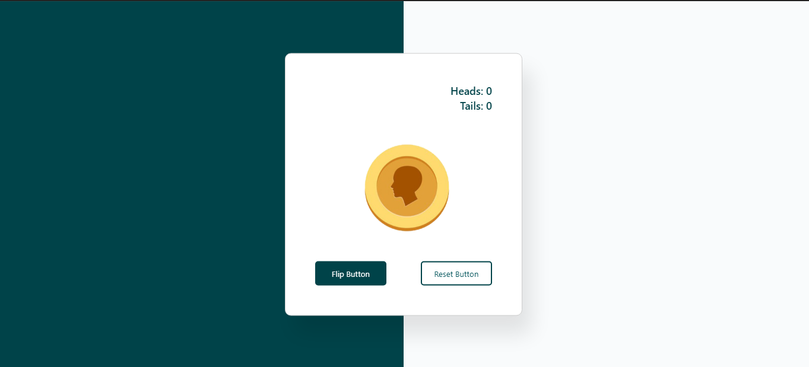

# Coin-Flip-Game-by-JS

A simple, clean, and interactive web-based coin flip game built with HTML, CSS, and JavaScript. Test your luck and see if you can guess the outcome correctly!

<h2>📜 Description</h2>

This project is a classic "Heads or Tails" game. Users can choose a side, click a button to flip the coin, and the game will display the result with a neat animation. The game also keeps track of the user's score, counting the number of correct and incorrect guesses.

<h2>💻 Technologies Used</h2>
<ul>
  <li><b>HTML:</b> For the basic structure and content of the game.</li>
  <li><b>CSS:</b> For styling, layout, and animations.</li>
  <li><b>Javascript:</b> For the game logic, event handling, and DOM manipulation.</li>
</ul>
<h2>🎮 How to Play</h2>

Open the index.html file in your web browser.

Select your choice: Click on either the "Heads" or "Tails" button.

Flip the coin: Click the "Flip Coin" button.

See the result: The coin will animate, and the result will be displayed.

Your score will be updated automatically. Play again as many times as you like!

<h2>That's it! You're ready to play.  <i> Enjoy the game!</i></h2>

